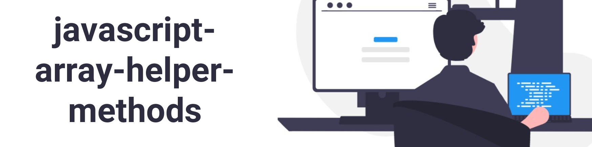

<h2 align="center">
  Javascript Array Helper Methods
</h2>

## :memo: Índice

1. forEach()
2. map()
3. filter()
4. find()
5. reduce()
6. some()
7. every()
8. from()
9. of()
10. findIndex()
11. Keys()
12. values()
